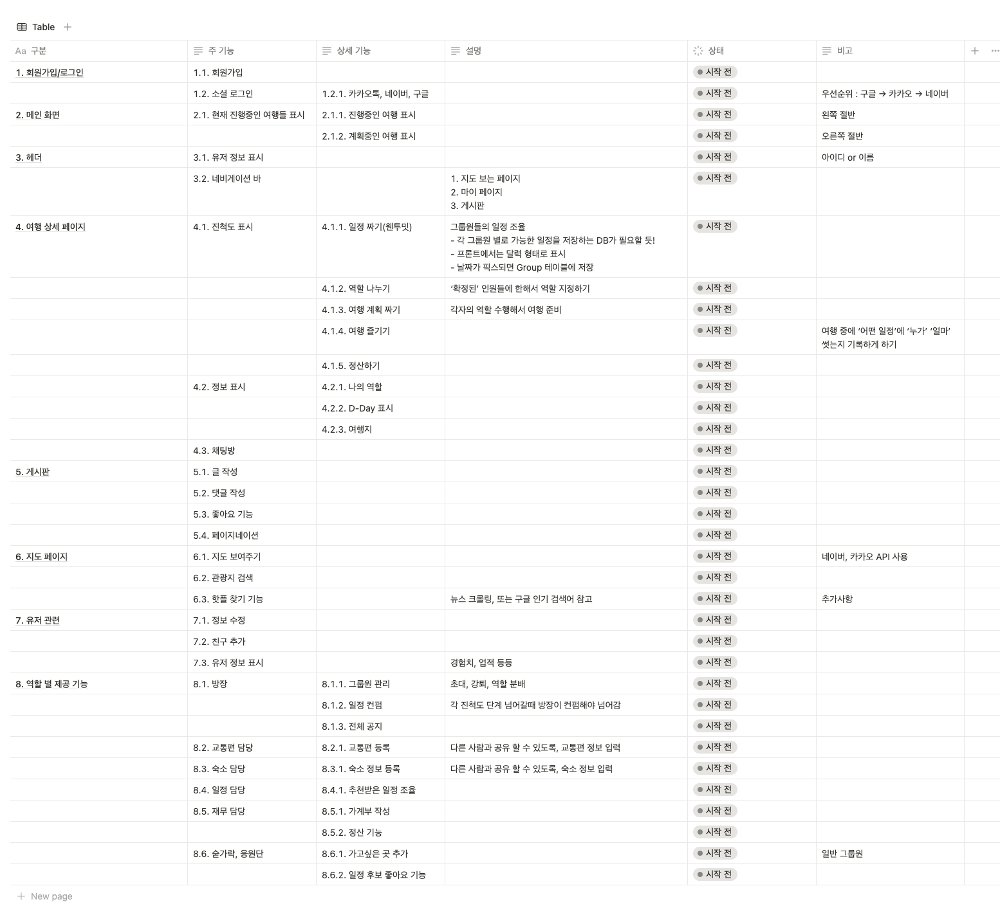
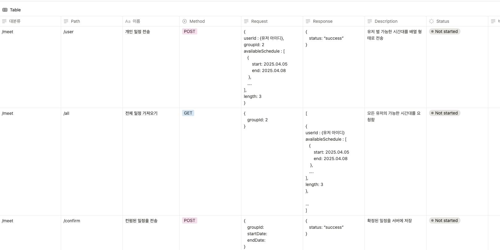
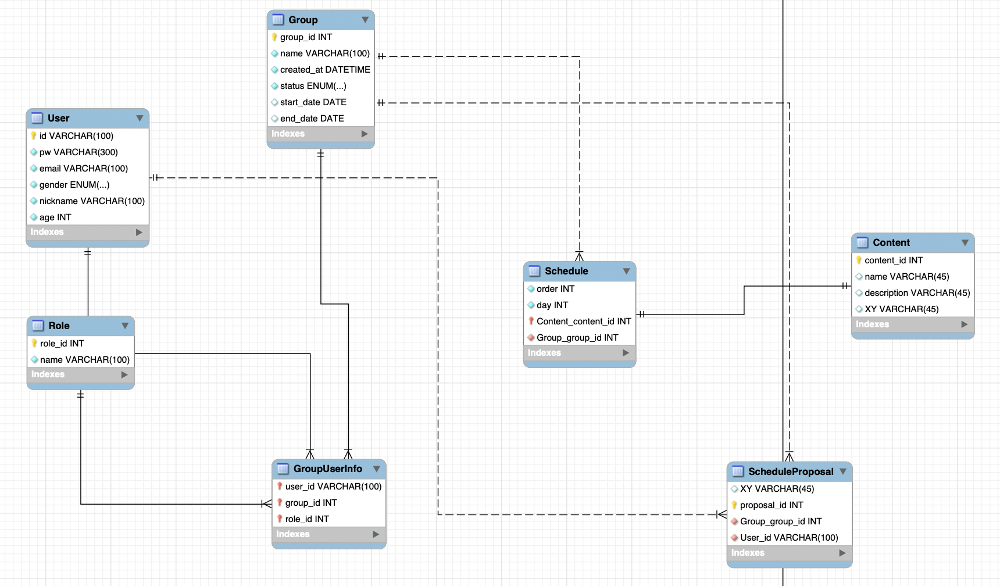

# ✨ 프로젝트 진행 기록 (2025.04.25)

1. 기능 명세표 작성  
   - 프로젝트에 필요한 주요 기능들을 정의하고 역할별로 정리함
2. API 명세서 일부 작성  
   - 핵심 API 몇 가지를 우선적으로 명세함
3. 데이터베이스 스키마 설계  
   - 유저, 그룹, 역할 등 일부 핵심 테이블의 구조를 설계함

---

## 📸 작업 스크린샷

> 여기에 스크린샷을 첨부해주세요!

- 기능 명세표  
  

- API 명세서  
  

- DB 스키마  
  

---
